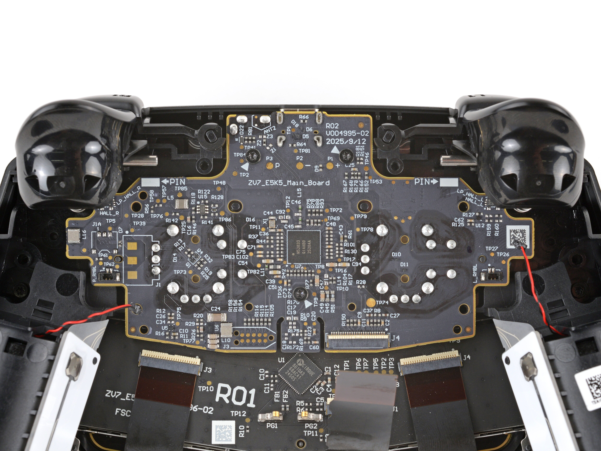
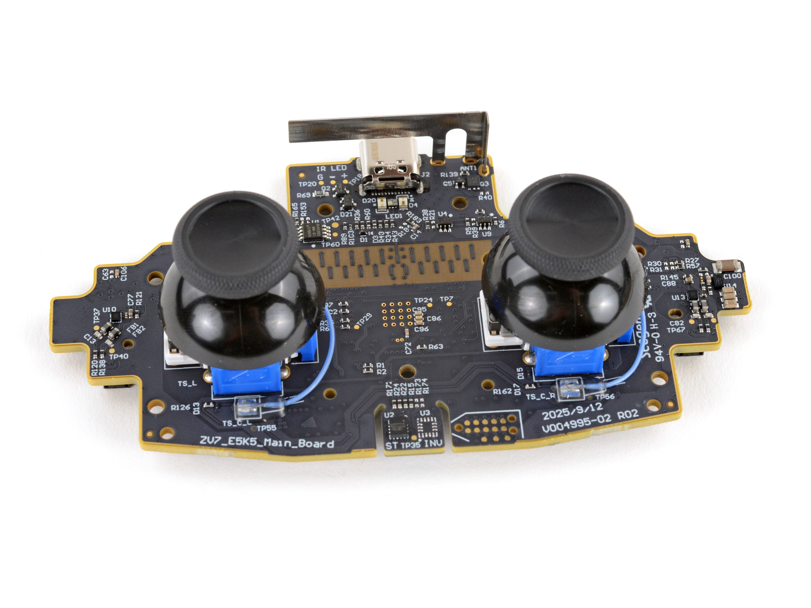
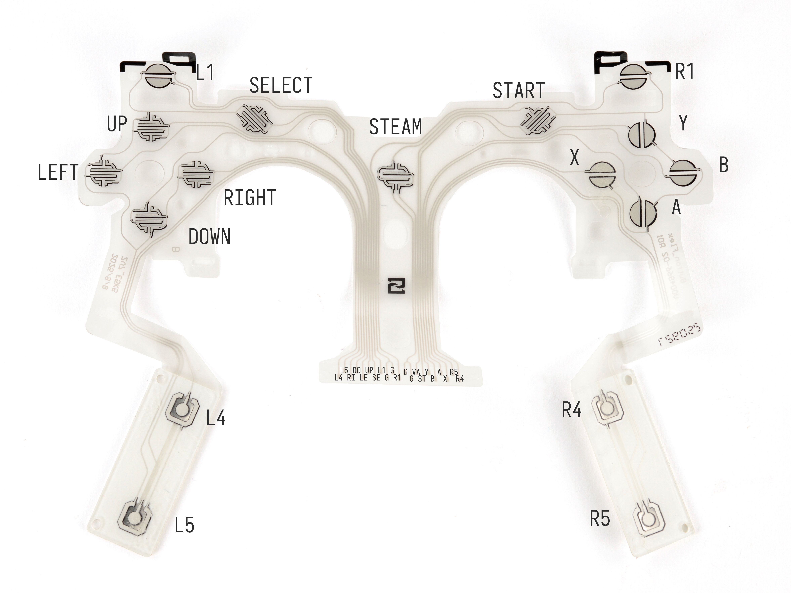
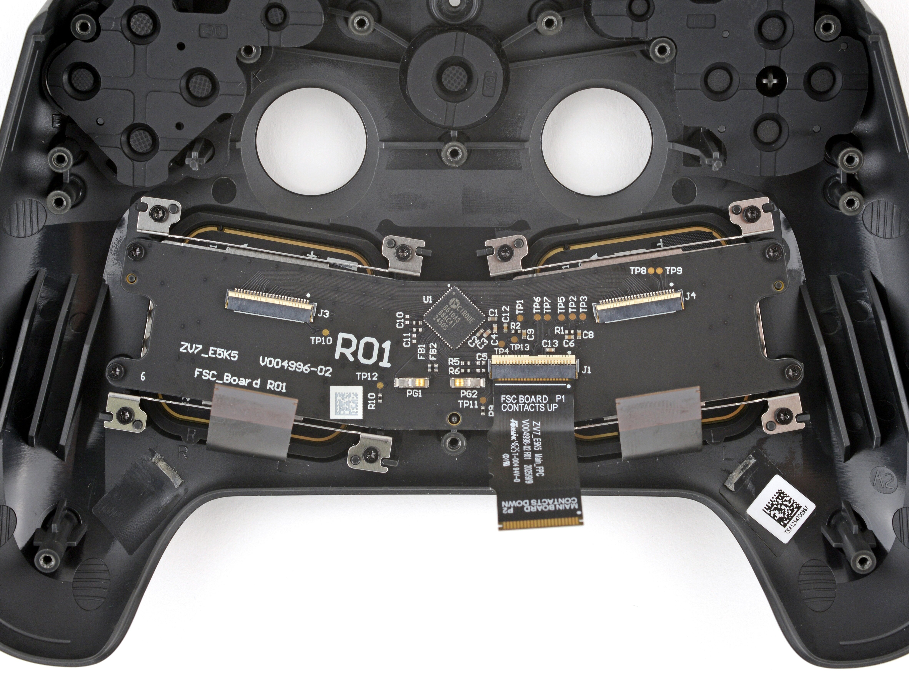
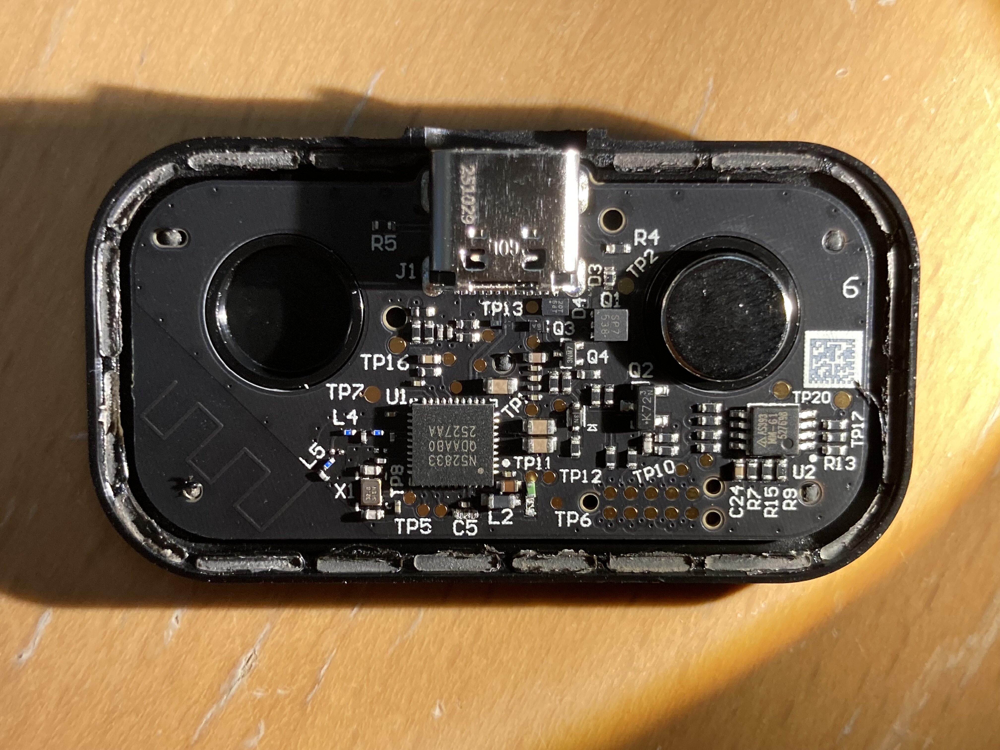
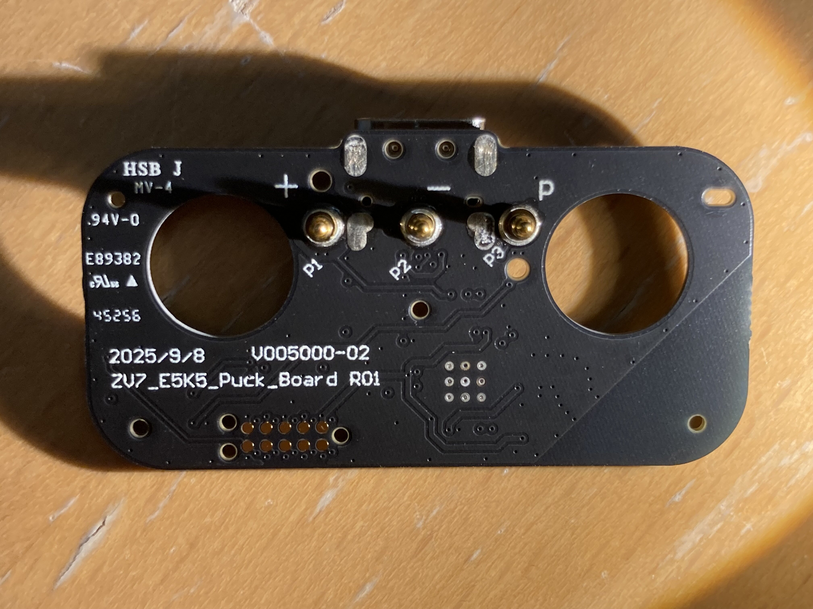

# Steam Controller 2026

The Steam Controller 2026 is a new controller released by valve in 2026,
featuring similar design from the original 2015 controller, but with an improved
layout, two TMR sticks, and brand new internals!

In this repository, we'll be investigating how they work, in the hope of making
a custom, open source firmware for them.

## Controller

The controller is made up of two boards: The mainboard, and the "FSC" daughter
board. The FSC daughterboard contains the logic chips to handle the two
trackpads, while the mainboard contains everything else.
The buttons are connected to the mainboard using a Flexible Button Circuit
(henceforce FBC).

### Main board

The main board consists of one main CPU, an nRF52833-QIAAB0.

### FBC Pinout

The buttons are connected to a FBC using the following PinOut:

When looking at the pinout from the back after removing the mainboard, it goes:
 | | | | | | | | | | |
---|---|---|-------|-----|-----|-----|--------|------|-----|----
R4 | A | Y | STEAM | GND | GND | L1  | UP     | DOWN | L5 |
R5 | X | B | START | GND | R1  | GND | SELECT | LEFT | RIGHT | L4

### FSC Daughterboard

This board has one main responsibility: it has the cirque logic chip to turn the
trackpad's raw data into something intelligible. Additionally, it seems to also
be responsible for handling the `...` button

## Puck

The puck has two main purposes: charging the controller, and providing it with
a wireless communication endpoint using the ESB protocol.

It consists of a single, very simple board, sporting an nRF52833-QDAA.

Chargin the controller is done through the three pogopins. P1 and P2 provide the
power and ground, while P3 is likely used for some kind of communication protocol.

