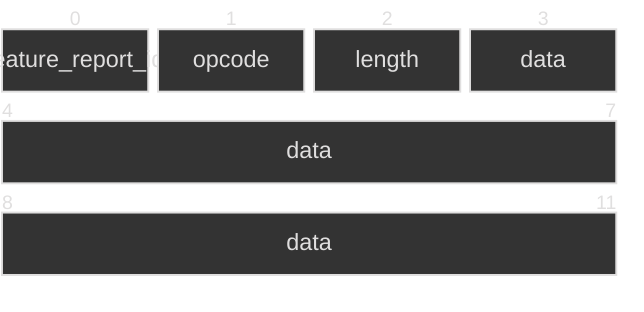

# Valve Protocol

The latest steam controller uses an evolution of Valve's unified protocol that
their old devices used (like the Steam Controller, it's dongle, the knuckle
controllers, etc...).

The protocol sits on top of HID, and uses Feature Reports for its
communications. It's a sort of remote procedure call protocol, where the Host
will send a packet via SET_FEATURE_REPORT to the device, and optionally retrieve
the result with GET_FEATURE_REPORT.

Each feature report is 0x40 bytes in size, in the following scheme:

The feature_report_id seems to be a protocol version ID, and is usually set
to the bcd_version. Only two versions exist for the dongle (1 and 2), and the
controller only supports one version (which is labeled 1, but is actually 2...)

## Report Requests

Name                    | Proteus1  | Proteus2  | Triton1
------------------------|-----------|-----------|--------
[ControllerInfoRequest] | 0xa6      | 0x83      | 0x83
RebootToBootloader      | 0x90      | 0x90      | 0x90
Reboot                  |           |           | 0x95
GetSerialNumber         | 0xa4      | 0xae      | 0xae

## ControllerInfoRequest

Gets information about the controller. Returns a list of
ControllerInfoAttributes of the form

| Offset | Name | Size
|--------|------|------
| 0x00   | Tag  | 1
| 0x1    | Value | 4

There is no padding between the elements. Here are the known tags:

| Tag | Value
|-----|-------
| 0   | Unique ID
| 1   | Product ID
| 2   | Capabilities
| 4   | Build Timestamp
| 5   | Radio Build Timestamp
| 9   | Hardware ID
| 10  | Boot Build Timestamp
| 11  | Frame Rate
| 12  | Secondary Build Timestamp
| 13  | Secondary Boot Build Timestamp
| 14  | Secondary Hardware ID
| 15  | Data Streaming
| 16  | Trackpad ID
| 17  | Secondary Trackpad ID

## Bootloader Protocol

In the bootloader, the controller appears as a serial device (CDC Class). While
in this state, the controller frames the data between the START_BYTE (0xad) and
the END_BYTE (0xae). The ESCAPE_BYTE (0xac) is used to escape any bytes that are
part of the framing, accoding to the following table:

| Raw Byte | Escaped Sequence |
|----------|------------------|
| AC       | AC00             |
| AD       | AC01             |
| AE       | AC02             |

Within those frames, the first two bytes contains an opcode in little endian,
and the rest are arguments to that opcode. So a full packet looks like this:

All messages (except for RESET) are follows by a response from the device,
containing the same structure.

The opcodes are as follows

| Opcode | Name         | Notes                                                 |
|--------|--------------|-------------------------------------------------------|
| 0x1233 | GetInfo      | gets a magic, hwid, unit and pcba. <II16s16s          |
| 0x1234 | Erase        | Starts a firmware transfer, erases the flash.         |
| 0x1235 | Data         | Transfers a chunk of data. Takes 0x8000 bytes of data |
| 0x1236 | End          | Marks the end of a firmware transfer. Relocks the flash? |
| 0x1237 | Reset        | Reboots the device                                    |
| 0x1238 | Provision    | ???                                                   |